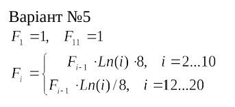

 
<b>МОНУ НТУУ КПІ ім. Ігоря Сікорського ФПМ СПіСКС</b>

 

 <b>Звіт до Розрахунково-графічної роботи</b> 
 дисципліни "Вступ до функціонального програмування"
 

 
<b>Студент</b>: Юдін Дмитро Олексійович КВ-21

 
<b>Рік</b>: 2025

 
### Загальне завдання

1. Реалізувати програму для обчислення функції згідно варіанту мовою Common Lisp. 
Варіант обирається згідно списку варіантів для лабораторних робіт за модулем 16: 
1 -> 1, 2 -> 2, ..., 17 -> 1, 18 -> 2 і т.д.
2. Виконати тестування реалізованої програми.
3. Порівняти результати роботи програми мовою Common Lisp с розрахунками 
іншими засобами.\

## Постановка задачі варіанту 5 (21) 

